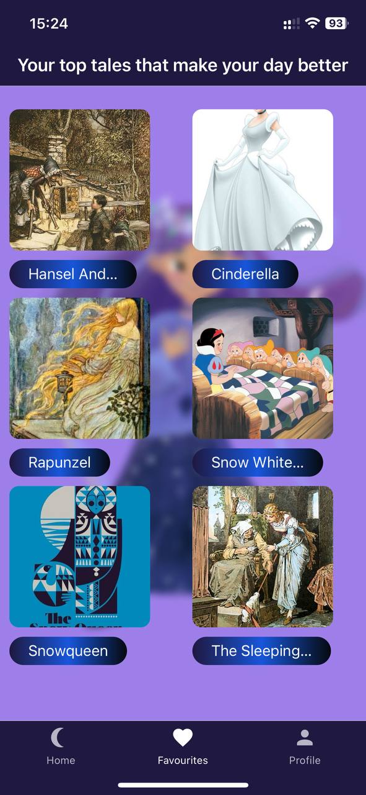
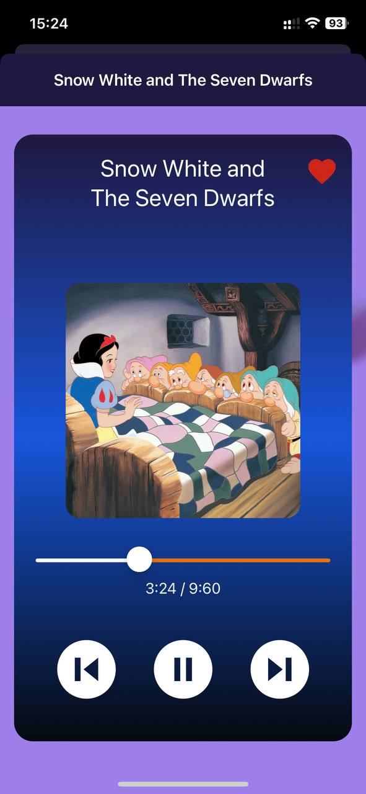
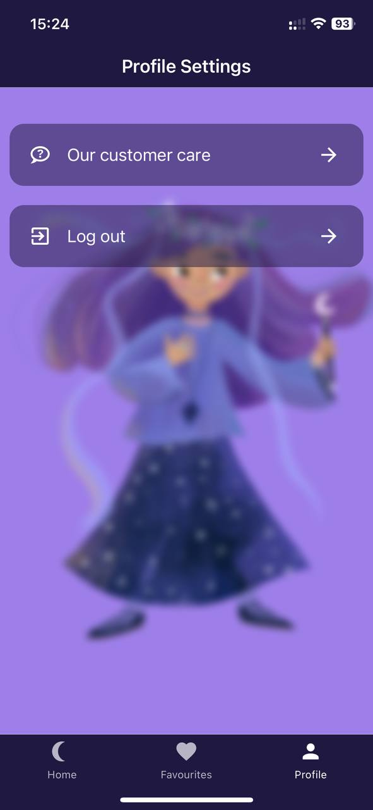

# Sweet Dreams

Good sleep is a mandatory thing to keep the mental health of your child in a good state. Sweet Dreams can help your child to relax and feel better.

Sweet Dreams is a delightful mobile application designed for children and their parents to explore and listen to popular tales. This application provides a curated list of enchanting stories that are perfect for bedtime or any time of day.

## Table of Contents

- [Features](#features)
- [Screenshots](#screenshots)
- [Installation](#installation)
- [Firebase](#firebase)
- [Usage](#usage)
- [Contributing](#contributing)
- [License](#license)
- [Contact](#contact)

## Features

- **User-Friendly Interface**: Easy navigation and intuitive design.
- **Diverse Collection**: Access a wide range of audio tales across different genres.
- **Favorites**: Save your favorite tales for quick access.


## Screenshots
### Home Screen

### Favourites Screen

### Empty Screen

### Login Screen

### Player Screen

### Settings Screen

### Registration Screen

### Support Screen


## Installation

Follow these steps to get the application running on your local machine.

### Prerequisites

- Node.js (v18.16.0) and npm (v9.5.1) installed
- Expo CLI installed
- Git installed

### Steps

1. **Clone the repository**:
   ```
   git clone https://github.com/yeryshevArtem/SweetDreams.git
   ```
2. **Navigate to the project directory**:
   ```
   cd ./sweet-dreams
   ```
3. **Install the dependencies**:
   ```
   npm install
   ```
4. **Start the development server**:
   ```
   npx expo start
   ```
5. **Open the app**:
   - Download the Expo Go app from the App Store or Google Play Store.
   - Scan the QR code generated by the expo start command with the Expo Go app.

## Firebase

Sweet Dreams uses Firebase as a storage and realtime database. In order to get an access to the server-side you need to create a firebase config file, name it as `config.js` and put in `./firebase` directory.

`config.js` must have the following format: 
```
// Your web app's Firebase configuration
// For Firebase JS SDK v7.20.0 and later, measurementId is optional
const firebaseConfig = {
    apiKey: "<YOUR_WEB_API_KEY>",
    authDomain: "<YOUR_AUTH_DOMAIN>",
    projectId: "<PROJECT_ID>",
    storageBucket: "<STORAGE_BUCKET>",
    messagingSenderId: "<MESSAGING_SENDER_ID>",
    appId: "<APP_ID>",
    measurementId: "<MEASUREMENT_ID>",
};


export const WEB_API_KEY = '<YOUR_WEB_API_KEY>';
export const API_DOMAIN = '<YOUR_API_DOMAIN>';
export const AUTH_DOMAIN = '<YOUR_AUTH_DOMAIN>';

export default firebaseConfig;
```

## Usage
   - Open the Expo Go app on your mobile device.
   - Scan the QR code to open the Sweet Dreams app.
   - Browse the collection of audio tales and select one to start listening.
   - Use the playback controls to pause, play, or skip through the tale.
   - Add tales to your favorites by tapping the heart icon.

## License
This project is licensed under the MIT License. See the LICENSE file for details.

## Contact
If you have any questions or feedback, please reach out to us at artem.yeryshev@gmail.com